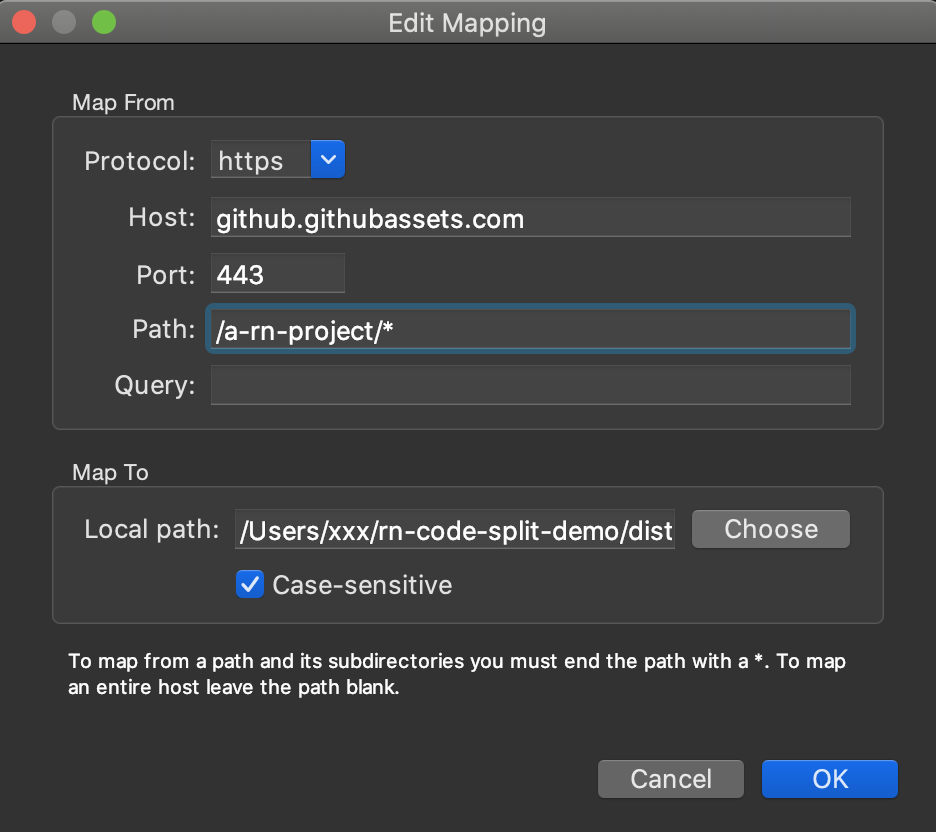

# rn-code-split-demo

The project is based on the official template, using the metro-code-split to implement the react-native code split example

## Test the load logic step（only demonstrate the ios）

1. yarn && cd ios && pod install // install dependencies

2. Use charles to simulate the load of business resources

- [import charles map local file](./ReadmeInfo/charles-map-local.xml)

  

- **Tip: Make sure the iOS Simulator has a charles certificate installed**

3. npm run ios or Using Xcode opens the ios/rnCodeSplitDemo.xcworkspace click run

- **Tip: manually merge \_dl.ios.bundle into buz.ios.bundle for test convenience (should be built into App in production)**

## Effect

  

